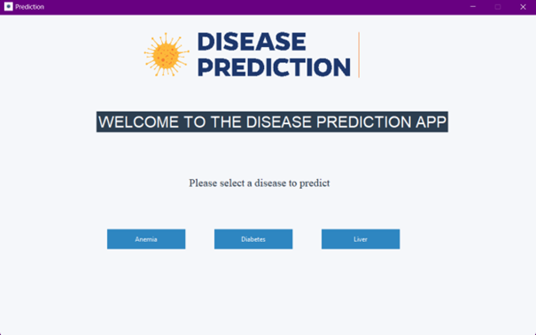
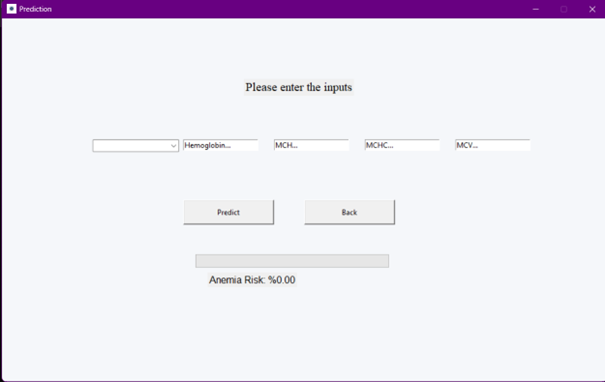
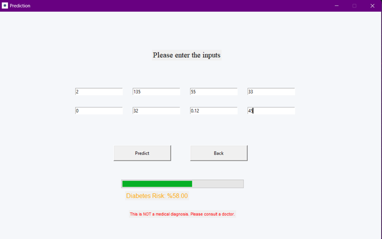
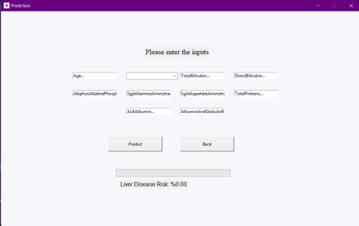

# Disease Prediction App

This is a desktop application developed using Python Tkinter and Machine Learning models.

## Features
- Anemia Prediction
- Diabetes Prediction
- Liver Disease Prediction

## Technologies
- Python
- Tkinter
- Scikit-learn
- Machine Learning

## Screenshots

### Home Screen

### Anemia Prediction

### Diabetes Prediction

### Liver Prediction

## Dataset

This project uses publicly available datasets from **Kaggle**:

- **Anemia Dataset**  
  Source: https://www.kaggle.com/datasets/biswaranjanrao/anemia-dataset

- **Diabetes Dataset (Pima Indians)**  
  Source: https://www.kaggle.com/datasets/johndasilva/diabetes

- **Liver Disease Patient Dataset**  
  Source: https://www.kaggle.com/datasets/abhi8923shriv/liver-disease-patient-dataset/data

> These datasets are used for educational and demonstration purposes only.  

⚠️ This application is an educational tool and should not be used for medical diagnosis. Consult a healthcare professional for clinical decision-making.

